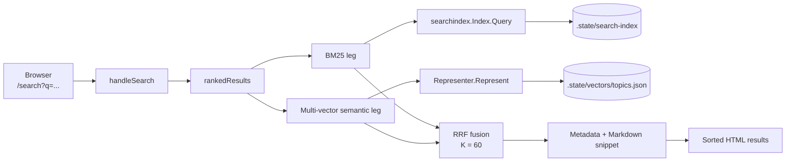
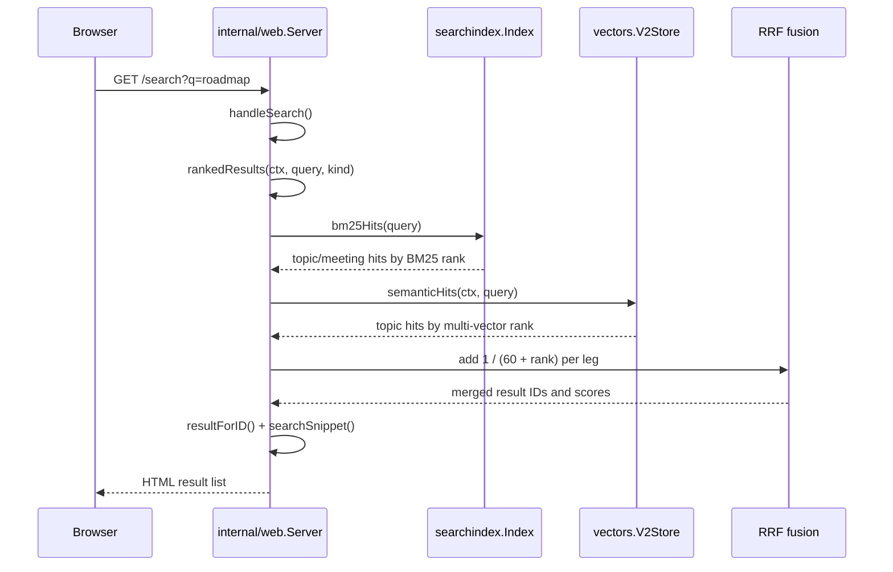
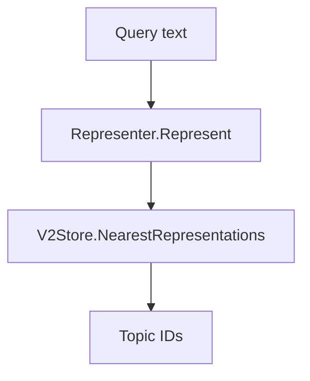
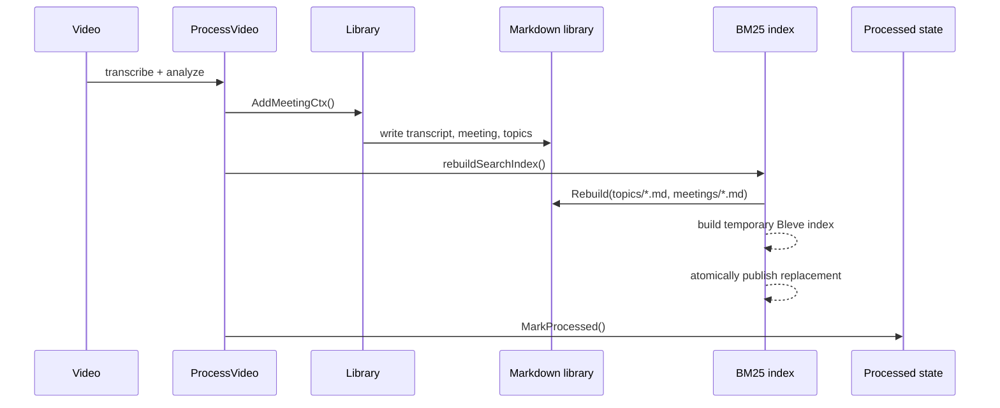
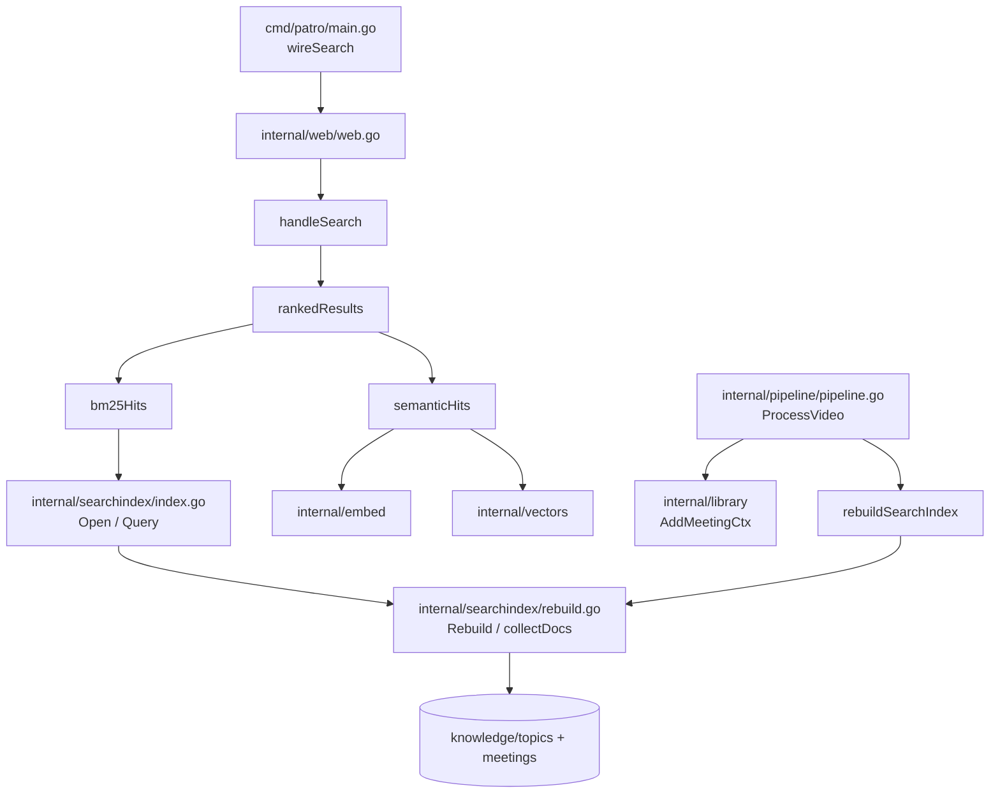
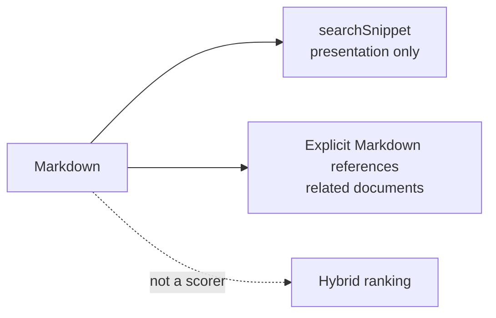

# Search architecture

Patro uses **hybrid retrieval**: BM25 finds exact lexical matches and embeddings
find semantically similar topics. The two ranked lists are combined with
**Reciprocal Rank Fusion (RRF)**. The old Markdown-wide lexical scoring pass is
not part of the search path anymore.

## At a glance



The two legs have different responsibilities:

| Leg | Finds | Current coverage |
| --- | --- | --- |
| BM25 | Terms, names, and phrases present in the text | Topics **and** meetings |
| Multi-vector embeddings | Similar meaning, paraphrases, and related concepts | Topics |

BM25 and embedding **raw scores are not added together**. RRF combines their
rank positions, which avoids pretending that the two score scales are
calibrated.

## Query flow



### BM25 leg

1. `bm25Hits` opens the configured index path for the request.
2. `searchindex.Index.Query` runs Bleve's query-string BM25 search.
3. The result carries an ID such as `topic:roadmap` or
   `meeting:2026-01-05-kickoff`.
4. The index handle is closed after the leg finishes. This prevents a long
   running web viewer from holding Bleve's lock while ingestion publishes a
   rebuilt index.

### Multi-vector semantic leg

`semanticHits` uses the single supported semantic path:



The backend must implement `Represent`; there is no one-vector fallback.
`Represent` creates the query representation, and `V2Store` ranks complete
document representations. Semantic IDs are normalized to the same `topic:slug`
namespace used by BM25 before fusion. A semantic-only topic can therefore
appear even when BM25 did not return it.

## Reciprocal Rank Fusion

For a document `d`, the current implementation computes:

```text
RRF(d) = Σ 1 / (K + rank(d))
```

with `K = 60`. The code stores ranks zero-based, so the implementation uses
`1 / (60 + rank + 1)`.

Example:

| Document | BM25 rank | Semantic rank | Fused score |
| --- | ---: | ---: | ---: |
| `topic:roadmap` | 1 | 1 | `1/61 + 1/61` |
| `meeting:standup` | 2 | — | `1/62` |
| `topic:strategy` | — | 1 | `1/61` |

The final deterministic tie-breakers are:

1. Fused RRF score, descending.
2. Document date, newest first.
3. Document ID, ascending.

## Index freshness

The Markdown library is the source of truth. BM25 is a derived index rebuilt
after every successfully written video:



The order matters: if rebuilding BM25 fails, `MarkProcessed` is not reached, so
the video remains eligible for retry. `searchindex.Rebuild` reconstructs the
whole index from Markdown and removes stale documents instead of adding only
the newest file.

`patro serve` and `patro reconcile` also rebuild BM25 when the derived index is
missing. Manual edits to existing Markdown files are outside the automatic
video-processing path; remove/rebuild the derived index when those edits must
be reflected immediately.

## Code map



| Responsibility | File | Methods / symbols |
| --- | --- | --- |
| HTTP route and rendering | `internal/web/web.go` | `handleSearch`, `writeSearchFilters`, `resultForID`, `searchSnippet` |
| Hybrid ranking | `internal/web/web.go` | `rankedResults`, `bm25Hits`, `semanticHits`, `reciprocalRank` |
| Web wiring | `cmd/patro/main.go` | `wireSearch` |
| BM25 query | `internal/searchindex/index.go` | `Open`, `Query` |
| BM25 rebuild | `internal/searchindex/rebuild.go` | `Rebuild`, `collectDocs` |
| Video freshness boundary | `internal/pipeline/pipeline.go` | `ProcessVideo`, `rebuildSearchIndex` |
| Semantic retrieval | `internal/embed`, `internal/vectors` | `Represent`, `NearestRepresentations` |

## What is intentionally not part of ranking?



- There is no second hand-written lexical score.
- Snippet generation does not create matches or alter ranking.
- “Related documents” are explicit Markdown links, not embedding results.
